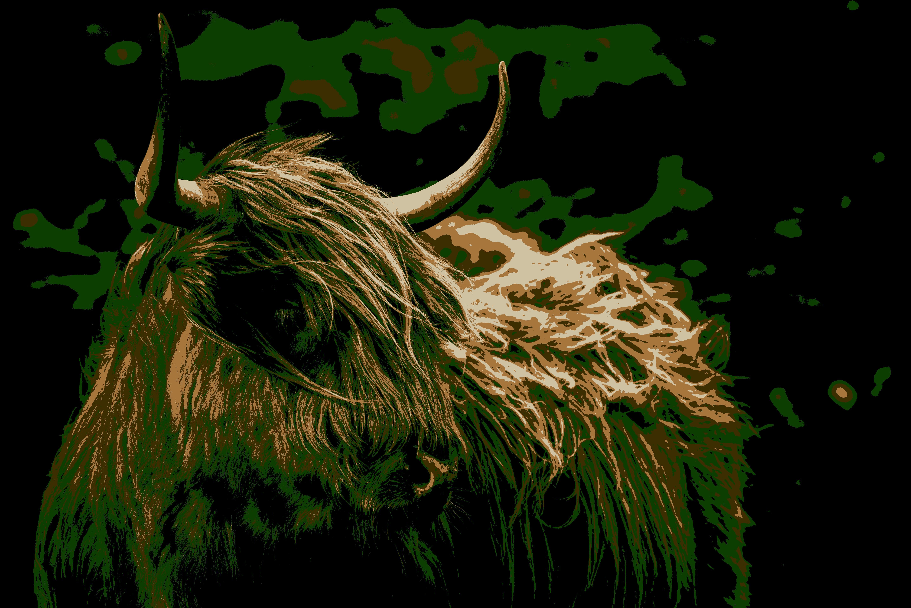

# K-means Color Reduction
Python project using the [k-means algorithm](https://en.wikipedia.org/wiki/K-means_clustering) to reduce colors in an image. The user inputs the image name located in the `source_images` folder and colors. The program then reduces the colors to the colors selected by the user.

## Algorithm
### Input Data
The initial values for centroids are the colors inputted by the user. The points are set of colors gathered from the image.

### The Conversion Process
The program supports two metrics for measuring distance - Euclidean and Taxicab. This is used when calculating the closest centroid from given point.

## Running the Program
When running the `main` function, the program will ask for the filename along with colors in the hex format. 
After providing inputs it will start two different conversion each with different metrics.

## Output
The `main` function will create a folder with the name of the image (without extension) with 3 files in it: 
 - converted_euc_[image_name].[image_format]
 - converted_tax_[image_name].[image_format]
 - details.txt

Image with prefix `converted_euc_` is the converted result using the Euclidean metric. The other image is the converted result using the Taxicab metric. 
The file `details.txt` contains information about the conversion - the name of the image, colors used and number of iterations and time elapsed.

## Results
All images are from Unsplash and have a high resolution.

### First Image
Colors used:

- 12, 61, 1  
- 61, 46, 1 
- 0, 0, 0 
- 207, 194, 163 
- 166, 118, 60 

Photo by <a href="https://unsplash.com/@presetbase?utm_source=unsplash&utm_medium=referral&utm_content=creditCopyText">Presetbase Lightroom Presets</a> on <a href="https://unsplash.com/t/animals?utm_source=unsplash&utm_medium=referral&utm_content=creditCopyText">Unsplash</a>

  
  

Euclidean (left) and Taxicab (right) metric

There can be seen some very small differences between conversion.

#### Number of Iterations
Euclidean: 33

Taxicab: 35

#### Time Elapsed
Euclidean: 30 seconds

Taxicab: 42 seconds

### Second Image
Colors used:

- 105, 85, 60  
- 17, 116, 191 
- 6, 81, 138 
- 100, 162, 209 
- 18, 79, 2 

Photo by <a href="https://unsplash.com/es/@glennsouer?utm_source=unsplash&utm_medium=referral&utm_content=creditCopyText">Glenn Souer</a> on <a href="https://unsplash.com/t/travel?utm_source=unsplash&utm_medium=referral&utm_content=creditCopyText">Unsplash</a>

  
  

Euclidean (left) and Taxicab (right) metric

There are visible differences between the metrics.

#### Number of Iiterations
Euclidean: 20

Taxicab: 23

#### Time Elapsed
Euclidean: 22 seconds

Taxicab: 32 seconds

### Third Image
Colors used:

- 153, 224, 242  
- 109, 175, 191 
- 18, 135, 163 
- 202, 216, 219 
- 242, 244, 245 
- 156, 160, 161 

Photo by <a href="https://unsplash.com/@tuninglever?utm_source=unsplash&utm_medium=referral&utm_content=creditCopyText">Alfred Leung</a> on <a href="https://unsplash.com/t/animals?utm_source=unsplash&utm_medium=referral&utm_content=creditCopyText">Unsplash</a>

  
  

Euclidean (left) and Taxicab (right) metric

There are also visible differences between the metrics.

#### Number of Iterations
Euclidean: 53

Taxicab: 69

#### Time Elapsed
Euclidean: 42 seconds

Taxicab: 70 seconds

## Conclusion
While working on this project I learned about the k-means algorithm. I observed the differences the metric selection made and the time it took to complete. 
